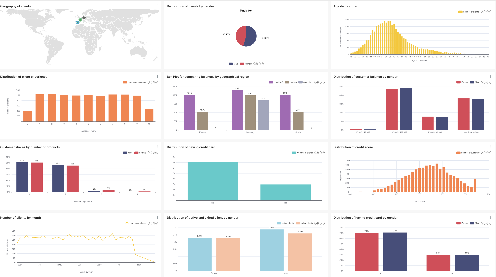

# Bank_clients_superset




### Инструкция по подключению PostgreSQL и Apache Superset ###

1. Создаем сервер в облаке и подключаемся к нему через терминал. Можно арендовать виртуальную машину на Selectel ([Selectel - Как создать облачный сервер?](https://docs.selectel.ru/cloud/servers/create/create-server/)) 
2. Устанавливаем Docker в соответствии со Step 1, 2 из [инструкции](https://www.digitalocean.com/community/tutorials/how-to-install-and-use-docker-on-ubuntu-22-04).
3. Создаем сеть(network) и хранилище (volume) для контейнера с БД:
    ```
    docker network create app_net
    
    docker volume create postgres_1_vol
    ```

4. Запускаем контейнер с PostgreSQL:
    ```bash
    docker run -d \
        --name postgres_1 \
        -e POSTGRES_USER=postgres \
        -e POSTGRES_PASSWORD='123' \
        -e POSTGRES_DB=test_app \
        -v postgres_1_vol:/var/lib/postgresql \
        postgres:15
    ```
    Запомните `POSTGRES_USER` и `POSTGRES_PASSWORD` – они понадобятся для подключения.

5. Запускаем контейнер Superset:
    ```bash
    docker run --rm -d \
        -p 8080:8088 \
        -e "SUPERSET_SECRET_KEY=$(openssl rand -base64 42)" \
        --name superset \
        apache/superset
    ```

6. Последовательно запускаем команды для настройки Superset: создание пользователя, обновление внутренней базы, инициализация сервиса:
    ```bash
    docker exec -it superset superset fab create-admin \
                --username admin \
                --firstname Superset \
                --lastname Admin \
                --email admin@superset.com \
                --password admin
    ```
    `username` и `password` используются для авторизации в Superset.

    Обновляем внутреннюю БД Superset:
    ```bash
    docker exec -it superset superset db upgrade
    ```

    Запускаем сервер Superset:
    ```bash
    docker exec -it superset superset init
    ```

7. Подключаем контейнеры к созданной сети:
    ```bash
    docker network connect <имя вашей сети> <имя контейнера postgres>
    ```

    ```bash
    docker network connect <имя вашей сети> <имя контейнера superset>
    ```

8. Добавляем данные в базу данных PostgreSQL:

   8.1 Зайти в контейнер, скачать, распаковать и добавить в Postgres базу прямо там. 
    Заходим в контейнер и запускаем `bash`  внутри: 
    ```
    docker exec -it <your_postgres_container_name> bash 
    ```
   8.2 Переходим в нужную папку (как на прошлой неделе): 
    ```
    cd /var/lib/postgresql/ 
    ```
   8.3 Обновляем и устанавливаем пакеты:
    ```
    apt-get update
    apt-get install -y wget  
    ```
   8.4 Скачиваем базу по (ссылке)[https://9c579ca6-fee2-41d7-9396-601da1103a3b.selstorage.ru/new_clients.csv]. (Тут)[https://www.kaggle.com/datasets/shrutimechlearn/churn-modelling] можно посмотреть описание датасета: 
    ```
    wget https://9c579ca6-fee2-41d7-9396-601da1103a3b.selstorage.ru/credit_clients.csv
    
    ```
   8.5 Переключаемся на пользователя `postgres` и создаем таблицу для базы данных: 
    ```
    su postgres

    CREATE TABLE credit_clients (
    date DATE,
    customerid BIGINT,
    surname TEXT,
    creditscore INTEGER,
    geography TEXT,
    gender TEXT,
    age INTEGER,
    tenure INTEGER,
    balance NUMERIC,
    numofproducts INTEGER,
    hascrcard INTEGER,
    isactivemember INTEGER,
    estimatedsalary NUMERIC,
    exited INTEGER);

   8.6 Добавляем данные в таблицу

    \copy customer_data FROM 'credit_clients.csv' DELIMITER ',' CSV HEADER;

    ```

10. Прокидываем соединение через SSH в локальном терминале:
    ```bash
    ssh -L 8080:localhost:8080 <user_name>@<ip-address>
    ```

    Переходим в браузере по адресу: [`http://localhost:8080/login/`](http://localhost:8080/login/)

11. После входа в Superset, нажимаем на "+" в правом верхнем углу -> "Database" и подключаем нашу базу данных.

12. Создаем датасет через SQL Lab запрос и настраиваем необходимые таблицы.
